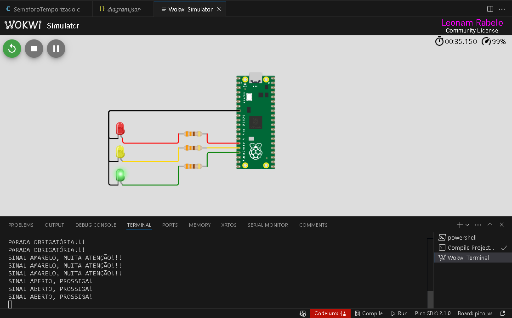

# Semáforo Temporizado

**Descrição**

Este projeto implementa um sistema de semáforo utilizando a placa Raspberry Pi Pico. O código controla três LEDs (vermelho, amarelo e verde) de forma cíclica, simulando o funcionamento de um semáforo real, utilizando o conhecimento em temporizador para o controle do mesmo.

**O LED vermelho inicia aceso, e a cada 3 segundos o estado dos LEDs muda seguindo a sequência:**

Vermelho ➔ Amarelo

Amarelo ➔ Verde

Verde ➔ Vermelho

Além do controle dos LEDs, mensagens são exibidas via serial para indicar o estado atual do semáforo.

# Compilando e Executando

- Necessário:
Instale o SDK do Raspberry Pi Pico e configure o ambiente de desenvolvimento.
VSCode com as extensões "Raspberry Pi Pico Project" e "Wokwi Simulator".
CMake

- Importe o projeto (pasta) a partir da extensão do Raspberry Pi Pico Project
- Compile o projeto, também por meio da extensão.

*No Wokwi VScode:*
- Abra o arquivo 'diagram.json' e execute (Play).

*Utilizando a placa física, como a BitDogLab:*
- Envie o arquivo gerado (.uf2) para a placa Raspberry Pi Pico.
- Conecte via UART para visualizar as mensagens de status do semáforo.

# Funcionamento

O LED vermelho inicia aceso.

A cada 3 segundos, o LED muda para a próxima cor seguindo a lógica de um semáforo.

Mensagens são exibidas na comunicação serial:

"PARADA OBRIGATÓRIA!!!" (quando o LED vermelho estiver aceso)

"SINAL AMARELO, MUITA ATENÇÃO!!!" (quando o LED amarelo estiver aceso)

"SINAL ABERTO, PROSSIGA!" (quando o LED verde estiver aceso)

Dependências

Este projeto requer a biblioteca pico-sdk, que deve estar corretamente configurada no ambiente de desenvolvimento.

# Screenshot

# Vídeo utilizando a BitDogLab e simulando no Wokwi
Link para o vídeo: https://youtu.be/Bvz3ca1SJVE

Ps.: Lembrando que o led amarelo da simulação no wokwi está sendo simulado na placa como o led na cor azul.
